# CA1 — Infrastructure as Code: Real-Time Network Intrusion Detection Pipeline

*Last updated: September 19, 2026*

## Overview
This project re-implements CA0's Producer → Kafka → Processor → MongoDB → REST API pipeline entirely as code. Terraform provisions the AWS infrastructure (four EC2 VMs, one shared security group, one SSH key pair) and Ansible configures every piece of software on top of it (Docker, Kafka, MongoDB, the processor, the producer, and a systemd-managed REST API). A fresh deploy — from empty AWS account to a fully working, smoke-tested pipeline — takes two commands. Destroying it and leaving zero remnants takes one.

The pipeline's function is unchanged from CA0: the producer replays labeled CICIDS2017 network-flow records onto a Kafka topic, the processor consumes them and writes results to MongoDB, and a REST API exposes flagged (`Bot`) traffic. What changed for CA1 is *how it gets built*: nothing here was clicked into existence by hand, and every step below was validated before moving to the next one.

## Demo Video
**[VIDEO LINK — https://youtu.be/pgluvohfW4A]**

Recorded live against a fresh `terraform apply` → `ansible-playbook site.yml` deploy: all four hosts pinging, the producer replaying 5,000 rows, the processor's alert log climbing in real time, and both REST endpoints returning live data.

## Architecture Diagram

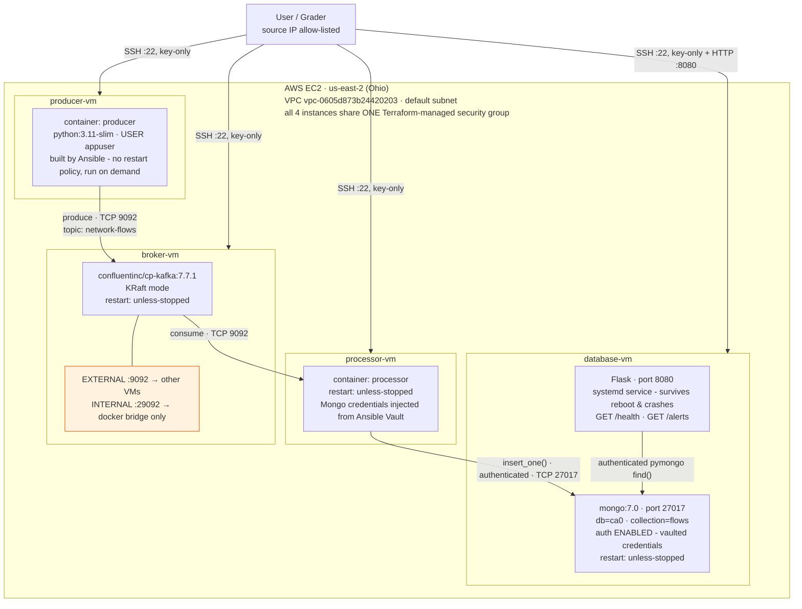
```mermaid
flowchart TB
    User["User / Grader<br/>source IP allow-listed"]

    subgraph AWS["AWS EC2 · us-east-2 (Ohio)<br/>VPC vpc-0605d873b24420203 · default subnet<br/>all 4 instances share ONE Terraform-managed security group"]
        direction LR

        subgraph PVM["producer-vm<br/>t3.medium (parameterized)"]
            PDock["container: producer<br/>python:3.11-slim · USER appuser<br/>built by Ansible - no restart policy, run on demand"]
        end

        subgraph BVM["broker-vm<br/>t3.medium"]
            KafkaNode["confluentinc/cp-kafka:7.7.1<br/>KRaft mode<br/>restart: unless-stopped"]
            KafkaPorts["EXTERNAL :9092 → other VMs<br/>INTERNAL :29092 → docker bridge only"]
            KafkaNode --- KafkaPorts
        end

        subgraph ZVM["processor-vm<br/>t3.medium"]
            ProcDock["container: processor<br/>restart: unless-stopped<br/>Mongo credentials injected from Ansible Vault"]
        end

        subgraph DVM["database-vm<br/>t3.medium"]
            MongoNode["mongo:7.0 · port 27017<br/>db=ca0 · collection=flows<br/>auth ENABLED - vaulted credentials<br/>restart: unless-stopped"]
            FlaskNode["Flask · port 8080<br/>systemd service - survives reboot & crashes<br/>GET /health · GET /alerts"]
            FlaskNode -->|"authenticated pymongo find()"| MongoNode
        end

        PDock -->|"produce · TCP 9092<br/>topic: network-flows"| KafkaNode
        KafkaNode -->|"consume · TCP 9092"| ProcDock
        ProcDock -->|"insert_one() · authenticated · TCP 27017"| MongoNode
    end

    User -->|"SSH :22, key-only"| PVM
    User -->|"SSH :22, key-only"| BVM
    User -->|"SSH :22, key-only"| ZVM
    User -->|"SSH :22, key-only + HTTP :8080"| DVM

    classDef internalOnly fill:#fff3e0,stroke:#e65100,stroke-width:1px
    class KafkaPorts internalOnly
```

## Automation Toolchain

How Terraform and Ansible actually hand off to each other — the part that didn't exist in CA0:

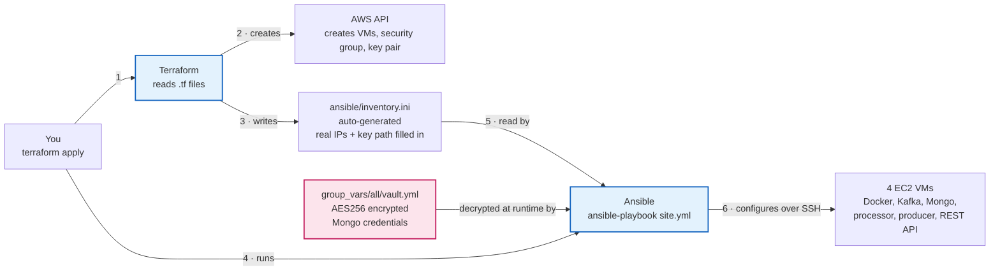
```mermaid
flowchart LR
    Dev["You<br/>terraform apply"]
    TF["Terraform<br/>reads .tf files"]
    AWSA["AWS API<br/>creates VMs, security group, key pair"]
    Inv["ansible/inventory.ini<br/>auto-generated<br/>real IPs + key path filled in"]
    Ans["Ansible<br/>ansible-playbook site.yml"]
    VMs["4 EC2 VMs<br/>Docker, Kafka, Mongo,<br/>processor, producer, REST API"]
    Vault["group_vars/all/vault.yml<br/>AES256 encrypted<br/>Mongo credentials"]

    Dev -->|"1"| TF
    TF -->|"2 · creates"| AWSA
    TF -->|"3 · writes"| Inv
    Dev -->|"4 · runs"| Ans
    Inv -->|"5 · read by"| Ans
    Vault -->|"decrypted at runtime by"| Ans
    Ans -->|"6 · configures over SSH"| VMs

    classDef toolNode fill:#e3f2fd,stroke:#1565c0,stroke-width:2px
    classDef secretNode fill:#fce4ec,stroke:#c2185b,stroke-width:2px
    class TF,Ans toolNode
    class Vault secretNode
```

No manual step connects these two tools: Terraform's `local_file.ansible_inventory` resource writes `ansible/inventory.ini` itself, with each VM's real public/private IP and the absolute path to the SSH key it just generated. Ansible has nothing to guess.

## Software Stack

| Component | Technology | Version |
|---|---|---|
| IaC — provisioning | Terraform | 1.16.3 |
| IaC — configuration | Ansible | core 2.21.4 |
| Pub/Sub hub | Apache Kafka (KRaft mode, no ZooKeeper) | `confluentinc/cp-kafka:7.7.1` |
| Database | MongoDB (auth enabled) | `mongo:7.0` |
| Producer | Python + `kafka-python`, Dockerized | Python 3.11-slim |
| Processor | Python + `kafka-python` + `pymongo`, Dockerized | Python 3.11-slim |
| REST API | Flask, run as a systemd service | Flask (systemd-managed) |
| Container runtime | Docker Engine + Compose plugin | 29.8.1 |
| Host OS | Ubuntu | 26.04 LTS |
| Cloud provider | AWS EC2 | us-east-2 (Ohio) |
| Secrets | Ansible Vault (AES256) | — |

## Environment

| VM | Role | Instance Type | Notes |
|---|---|---|---|
| producer-vm | Producer container | t3.medium (parameterized) | No restart policy — one-shot replay, run on demand |
| broker-vm | Kafka (KRaft) | t3.medium | `restart: unless-stopped` |
| processor-vm | Processor container | t3.medium | `restart: unless-stopped` |
| database-vm | MongoDB + REST API | t3.medium | Mongo `restart: unless-stopped`; REST API is a systemd unit |

All four VMs share one Terraform-managed key pair (`ca1-key`) and one security group (`ca1-pipeline-sg`), in the same default VPC CA0 used (`vpc-0605d873b24420203`). Public IPs are assigned fresh by AWS on every `terraform apply` and are not fixed here — run `terraform output public_ips` after a deploy to get current values.

## Prerequisites

- **Terraform** ≥ 1.16 — `brew install hashicorp/tap/terraform` (macOS)
- **Ansible** ≥ 2.21 — `brew install ansible` (macOS; pulls Python 3.14 and a handful of crypto libraries as dependencies)
- **AWS CLI** ≥ 2.36 — `brew install awscli`
- **An AWS account**, with an IAM user for Terraform to use. This project uses a dedicated user, `ca1-terraform`, with the `AmazonEC2FullAccess` managed policy attached — not the account root, and not a personal admin user.
- **A static AWS access key for that IAM user**, configured via `aws configure` — not `aws login`. The AWS CLI's newer `aws login` (browser-based SSO-style flow, CLI ≥ 2.32) is not recognized as a valid credential source by the Terraform AWS provider ([hashicorp/terraform-provider-aws#45316](https://github.com/hashicorp/terraform-provider-aws/issues/45316), open as of this writing). `aws configure` with a static access key ID/secret works with both the CLI and Terraform, so that's what this project uses.
- **Your own public IP**, for the security group's SSH/REST rules — get it with `curl https://checkip.amazonaws.com`.

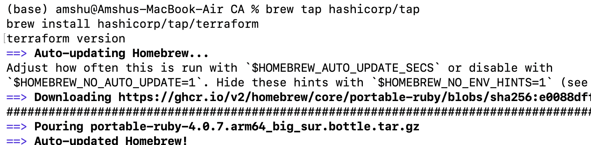
*`brew tap hashicorp/tap && brew install hashicorp/tap/terraform`.*

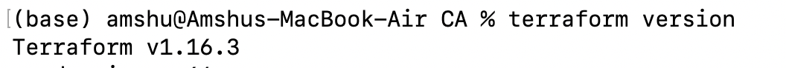
*`terraform version` → 1.16.3.*

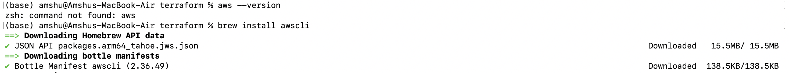
*`brew install awscli`, then confirming with `aws --version`.*

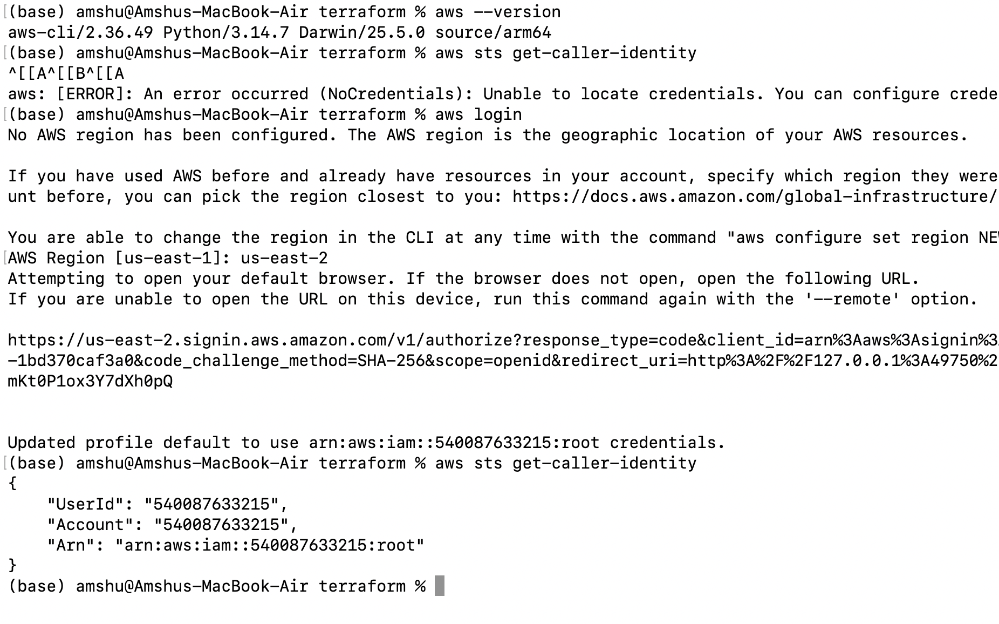
*`aws configure` with the `ca1-terraform` user's static access key — not `aws login`, for the reason explained above.*

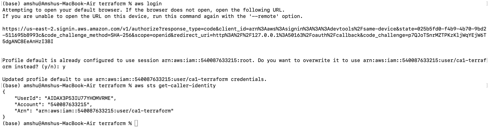
*`aws sts get-caller-identity` → `user/ca1-terraform`, not `root`.*

## Repository Structure

```
CA1
├── ansible
│   ├── ansible.cfg
│   ├── group_vars
│   │   └── all
│   │       ├── vault.yml            # encrypted — Mongo credentials (gitignored key, committed ciphertext)
│   │       └── vault.yml.example    # committed template, shows the two keys to fill in
│   ├── roles
│   │   ├── docker/tasks/main.yml
│   │   ├── kafka/{tasks/main.yml, templates/docker-compose.yml.j2}
│   │   ├── mongo/{tasks/main.yml, templates/docker-compose.yml.j2}
│   │   ├── processor/{files/{Dockerfile,processor.py}, tasks/main.yml}
│   │   ├── producer/{files/{Dockerfile,producer.py,Friday-Morning-5000-mixed-bot.csv}, tasks/main.yml}
│   │   └── restapi/{files/rest_app.py, tasks/main.yml, templates/rest_api.service.j2}
│   ├── site.yml                     # orchestrates all six roles in order
│   └── inventory.ini                # AUTO-GENERATED by Terraform — do not hand-edit
└── terraform
    ├── versions.tf                  # provider requirements (aws ~>5.0, tls ~>4.0, local ~>2.0)
    ├── variables.tf                 # aws_region, instance_type, my_ip_cidr
    ├── key_pair.tf                  # generates ca1-key (RSA 4096), saves it locally
    ├── network.tf                   # reads the default VPC + a subnet in it
    ├── security.tf                  # ca1-pipeline-sg — the one shared security group
    ├── compute.tf                   # the 4 EC2 instances, via for_each over a map
    ├── outputs.tf                   # public_ips, private_ips, ssh_command_example
    ├── inventory.tf + inventory.tpl # writes ../ansible/inventory.ini
    ├── terraform.tfvars             # GITIGNORED — contains your real IP
    └── .terraform.lock.hcl          # committed, pins provider versions
```

## Terraform Build, Validated Incrementally

Each `.tf` file was written and validated on its own before the next one was added — `terraform validate` doesn't require real AWS credentials, so this catches syntax errors immediately rather than at apply time. This sequence caught an actual bug: a missing newline in `variables.tf` that `validate` flagged right away.

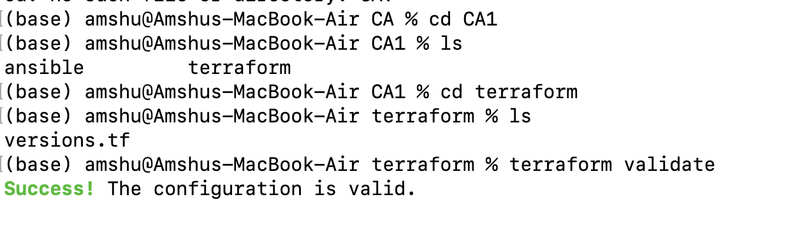
*`versions.tf` — provider requirements — created, then `terraform validate` confirms it's syntactically valid before anything else is added.*

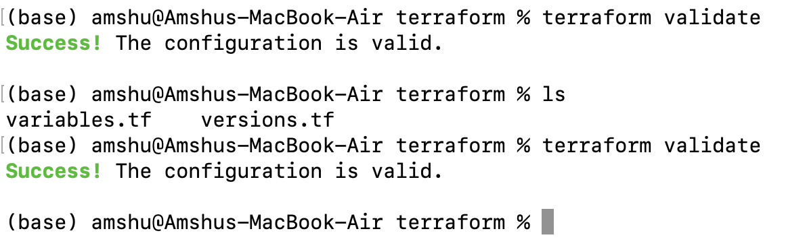
*`variables.tf` added next; validated again. (An earlier pass at this file was missing a newline and `validate` caught it immediately.)*

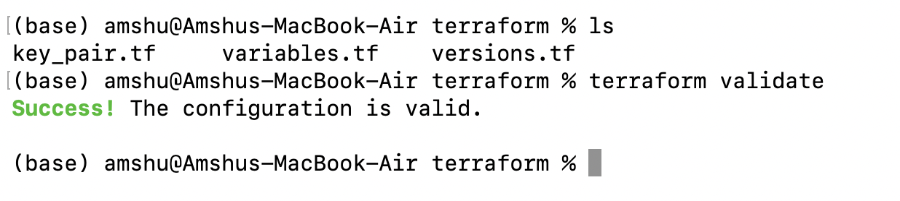
*`key_pair.tf` — the RSA key generation and local save logic.*

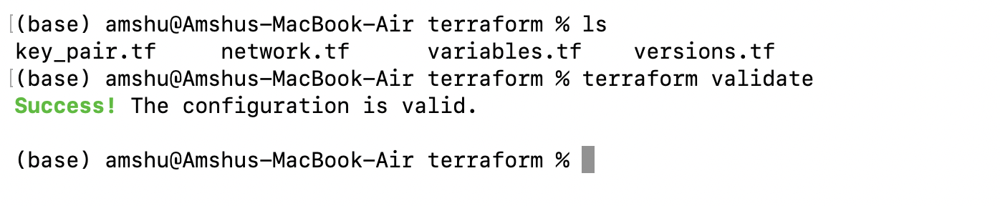
*`network.tf` — the data sources that read the default VPC and pick a subnet.*

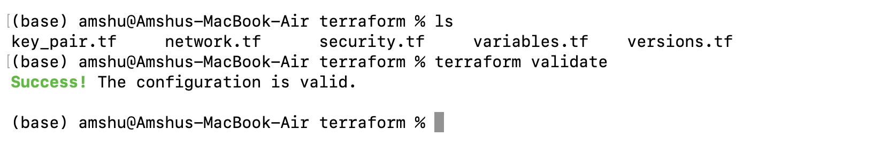
*`security.tf` — the shared security group definition.*

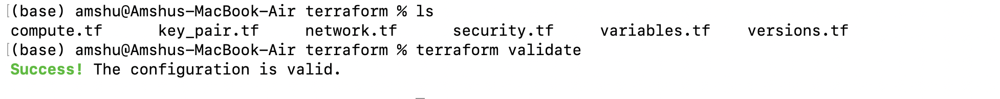
*`compute.tf` — the four EC2 instances, defined with `for_each` over a map so adding a fifth VM later is a one-line change.*

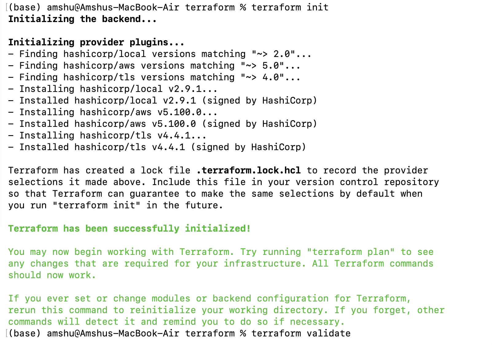
*`terraform init` — downloads the `aws`, `tls`, and `local` providers and creates the lock file, once all the files above existed.*

## Secret Management

MongoDB's admin credentials never appear in plaintext anywhere in this repo. They live in `ansible/group_vars/all/vault.yml`, encrypted with Ansible Vault (AES256), and are injected into the Mongo container, the processor container, and the REST API's systemd unit as environment variables at configure time.

To reproduce this on a fresh checkout:
```bash
cd CA1/ansible
cp group_vars/all/vault.yml.example group_vars/all/vault.yml
nano group_vars/all/vault.yml       # fill in vault_mongo_root_username / vault_mongo_root_password
echo "your-chosen-vault-password" > .vault_pass
ansible-vault encrypt group_vars/all/vault.yml
```
`ansible.cfg` points at `.vault_pass`, so `ansible-playbook` decrypts automatically — no `--ask-vault-pass` needed. Both `vault.yml` (post-encryption) and `.vault_pass` are gitignored; only `vault.yml.example` is committed.

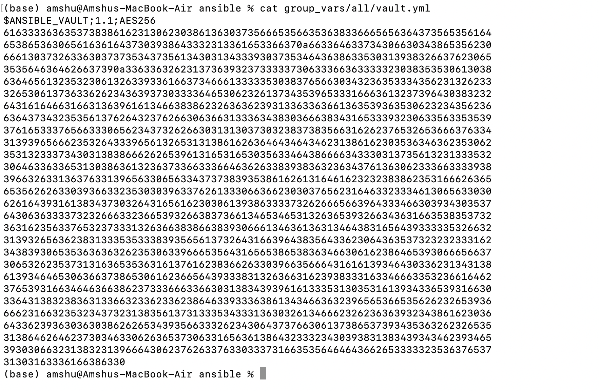
*`cat group_vars/all/vault.yml` — AES256 ciphertext, not plaintext.*

## Parameterization

Everything in `variables.tf` has a sensible default except your IP, which has none on purpose (so nobody accidentally commits a wide-open rule):

| Variable | Default | Purpose |
|---|---|---|
| `aws_region` | `us-east-2` | Where everything gets created |
| `instance_type` | `t3.medium` | Size of all four VMs — bump this in `terraform.tfvars` to push the pipeline harder in later assignments |
| `my_ip_cidr` | *(none — required)* | Your IP, scoped to `/32`, for SSH and REST API access |

Override any of these in `terraform.tfvars`:
```
my_ip_cidr    = "YOUR_IP_HERE/32"
instance_type = "t3.medium"
aws_region    = "us-east-2"
```

## How to Deploy

```bash
# One-time setup
cd CA1/terraform
terraform init

# Every deploy
terraform apply        # type "yes" when prompted
cd ../ansible
ansible-playbook site.yml
```

`terraform apply` creates the four VMs, the key pair, and the security group, then writes `../ansible/inventory.ini` with the real IPs. `ansible-playbook site.yml` then runs all six roles in order: Docker on every VM, then Kafka, MongoDB, the processor, the producer, and finally the REST API.

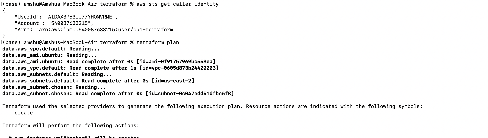
*The full plan for a deploy: instances, key pair, security group, local key file, and generated inventory.*

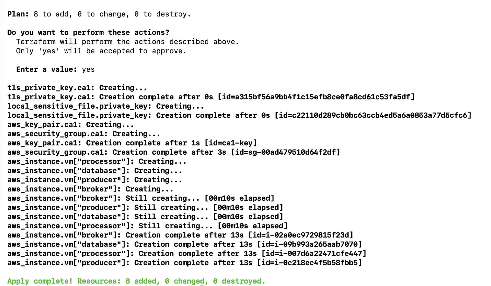
*Apply completing — the `public_ips` / `private_ips` / `ssh_command_example` outputs are printed immediately.*

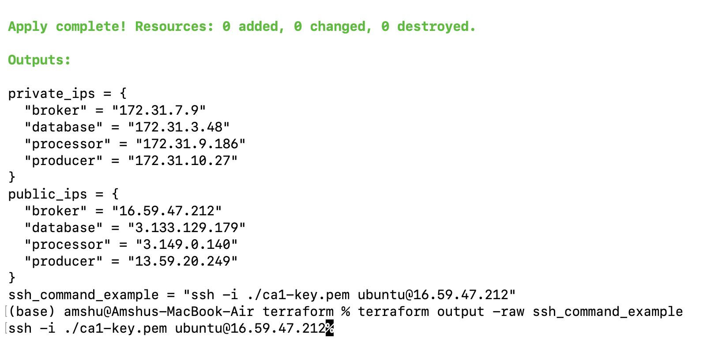
*An early version used a relative key path (`./ca1-key.pem`), which broke when Ansible ran from a different working directory. Fixed by switching to `abspath()` in `key_pair.tf`, which forced Terraform to recreate the key file and inventory — a real, caught-and-fixed bug, not a hypothetical one.*

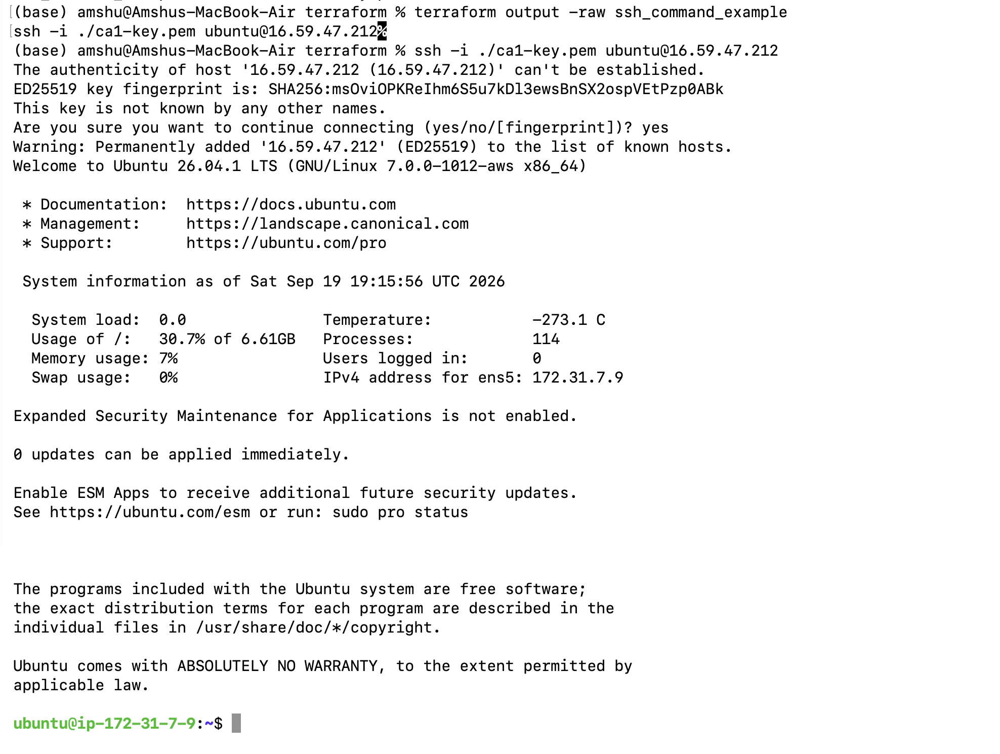
*SSH into the broker VM using the Terraform-generated key, confirming the key pair actually works end to end.*

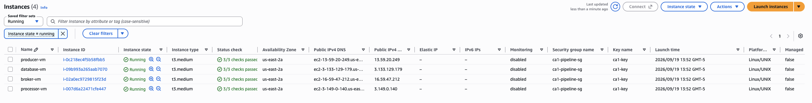
*All four instances up immediately after apply, tagged and named clearly.*

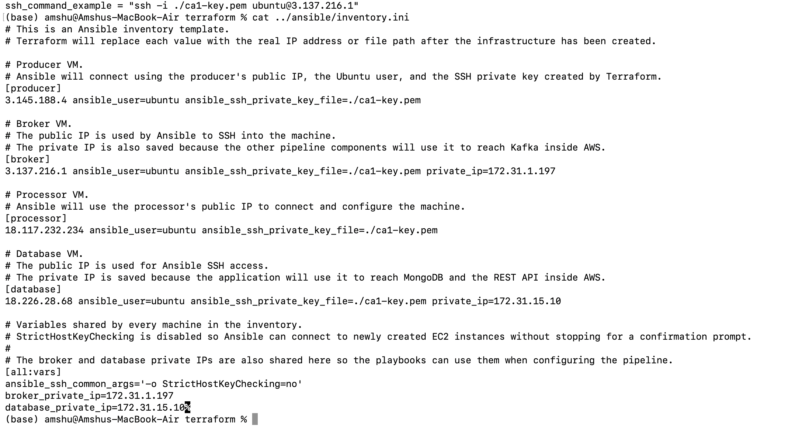
*`cat ../ansible/inventory.ini` — Terraform's `templatefile()` output, with no manual editing.*

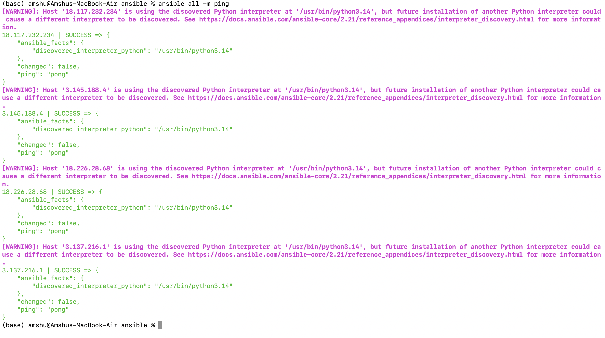
*`ansible all -m ping` — all four report `pong` before any configuration runs.*

## How to Destroy

```bash
cd CA1/terraform
terraform destroy      # type "yes" when prompted
```

One command tears down everything Terraform created — all four instances, the key pair, the security group, the local private key file, and the generated inventory file. Nothing is left behind.

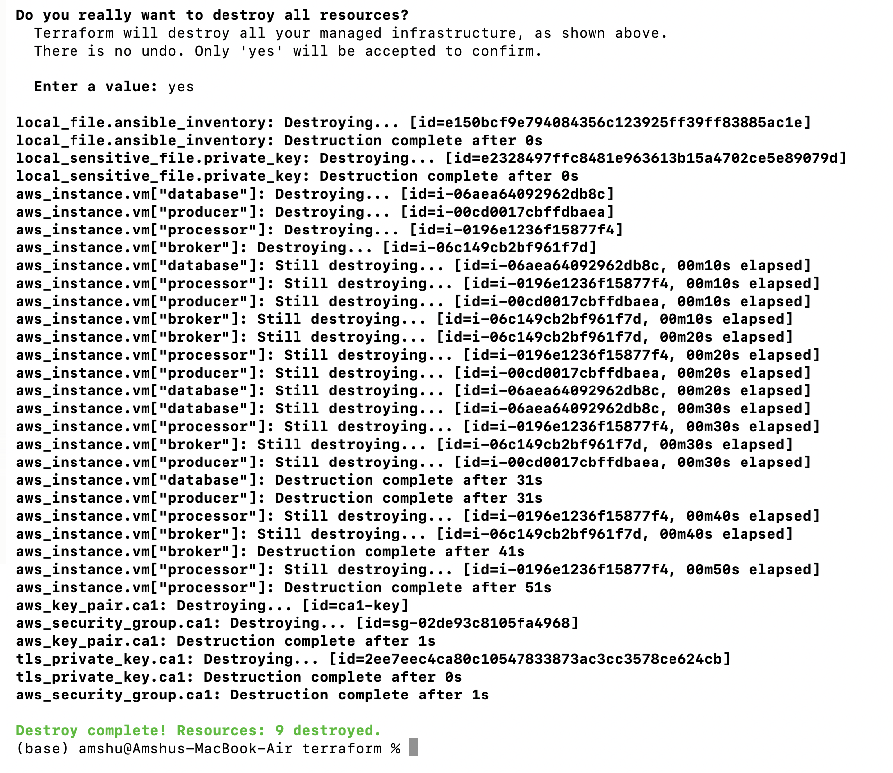
*Full teardown of a completely-configured pipeline (Docker, Kafka, Mongo, everything Ansible touched), not just the bare infrastructure.*

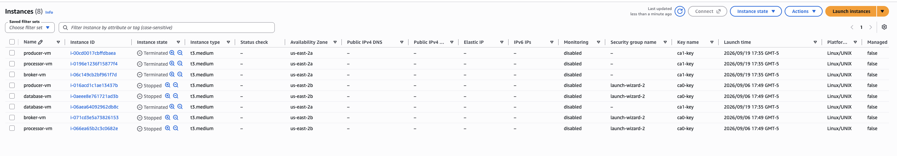
*Independently verified in the console — all four `ca1-*` instances terminated.*

## Reproducibility: Proven With a Full Round Trip

Idempotency isn't just claimed here — it was actually tested by tearing everything down and building it back up a second time, before any Ansible configuration existed:

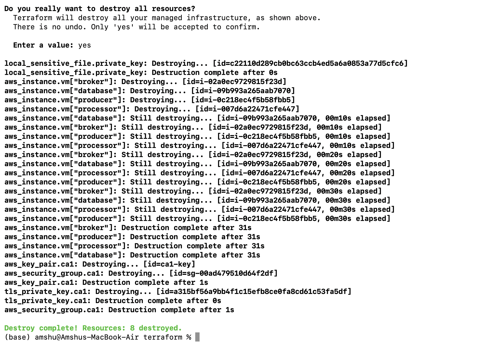
*First destroy of the round-trip test.*

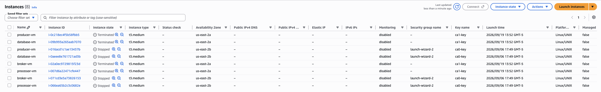
*Independently verified empty before re-applying.*

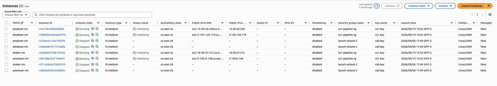
*A fresh `terraform apply` producing four entirely new instance IDs and IPs (shown here next to CA0's separate, stopped VMs for context) — proof this isn't tied to leftover state from the first run.*

## Ansible Role-by-Role Evidence

Six roles, run in order by `site.yml`. Each one's `PLAY RECAP` was checked for `failed=0, unreachable=0` before moving to the next.

**Docker (all four VMs)** — installs Docker Engine + the Compose plugin from Docker's official apt repo (not the older distro-default package), adds `ubuntu` to the `docker` group, and verifies with `hello-world`.

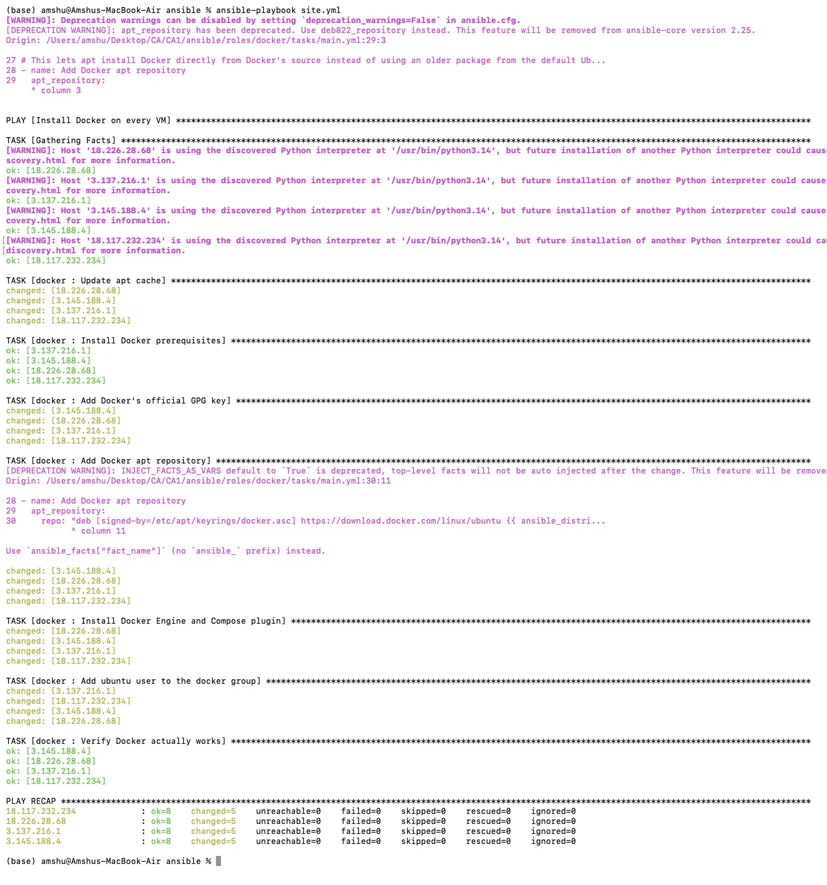
*The `docker` role's full playbook run.*

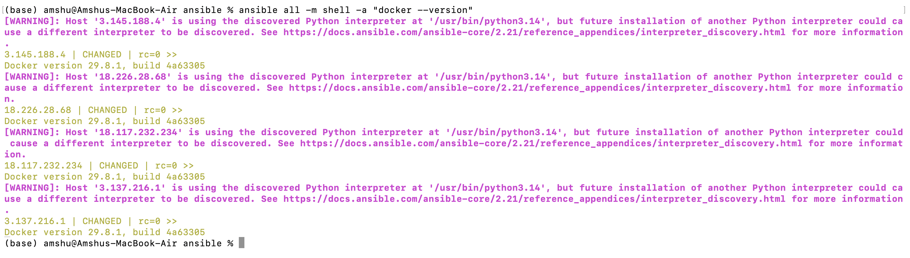
*`ansible all -m shell -a "docker --version"` — all four report the same version.*

**Kafka (broker only)** — templates and starts a KRaft-mode Kafka broker via Docker Compose.

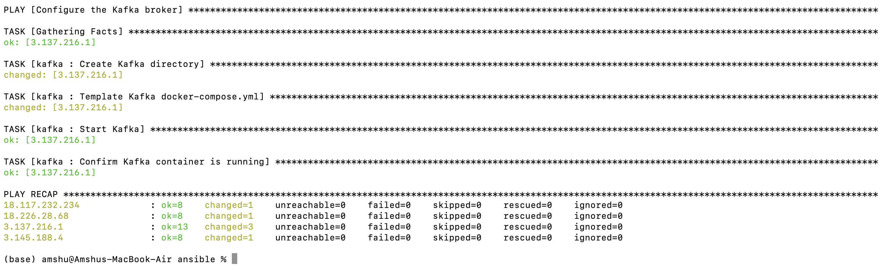
*The `kafka` role's playbook run.*

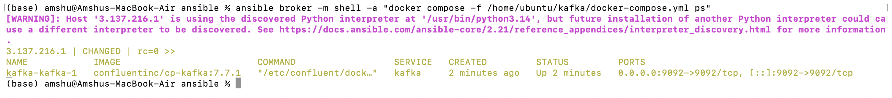
*`docker compose ps` on the broker VM — the Kafka container is `Up`, port 9092 mapped.*

**MongoDB (database only)** — templates a Compose file with credentials pulled from Ansible Vault and starts Mongo with authentication enabled.

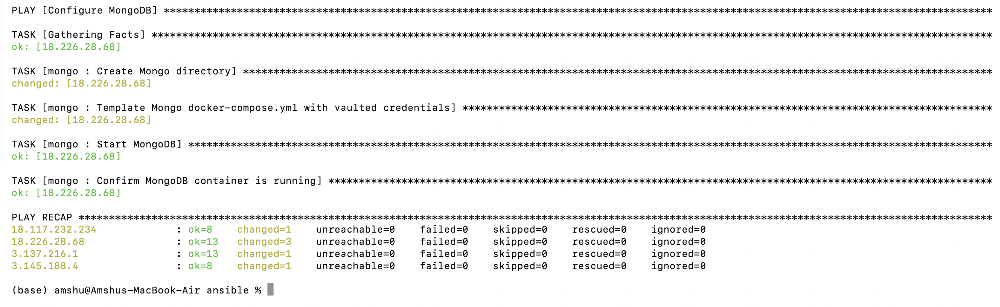
*The `mongo` role's playbook run — the templated Compose file never contains a plaintext credential; only the rendered `{{ vault_... }}` values do, on the VM itself.*

**Processor (processor only)** — copies the source and Dockerfile, builds the image, and runs it with Kafka and Mongo connection info (including vaulted credentials) passed in as environment variables.

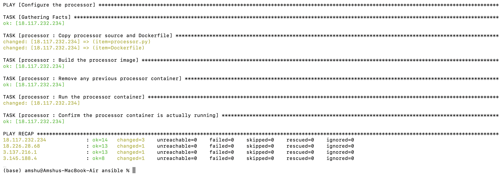
*The `processor` role completing — image built, old container removed, new one started and confirmed running.*

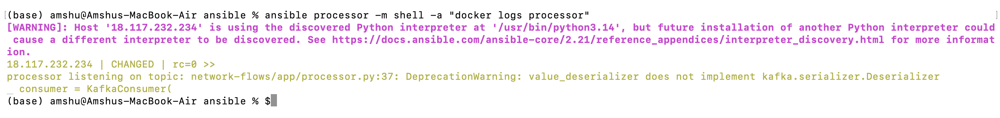
*`docker logs processor` — `processor listening on topic: network-flows`.*

**Producer (producer only)** — copies the source, Dockerfile, and the demo CSV, then builds the image. No container is started here by design — the producer is a one-shot replay tool, run on demand during the smoke test.

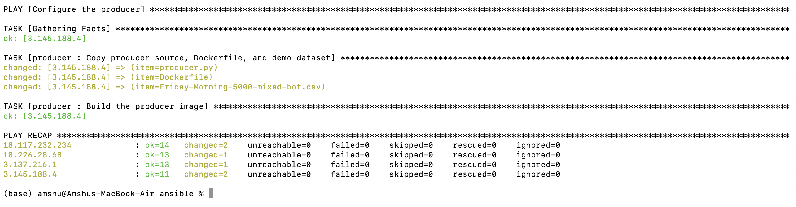
*The `producer` role completing — files copied, image built.*

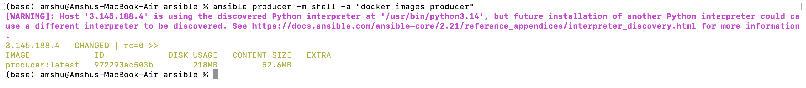
*`docker images producer` — the image exists and is a reasonable size.*

**REST API (database only)** — installs Flask and pymongo, copies `rest_app.py`, templates a systemd unit with vaulted credentials, and enables/starts it as a real service.

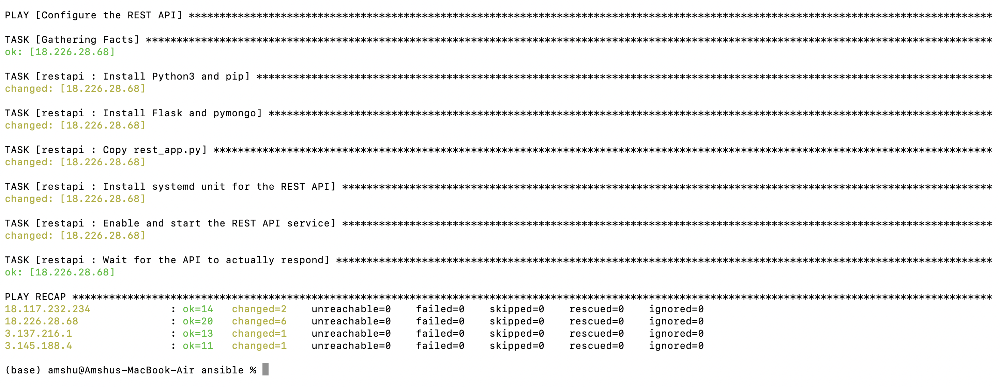
*The `restapi` role completing — Python packages installed, systemd unit templated and started, health check passed as part of the role itself.*

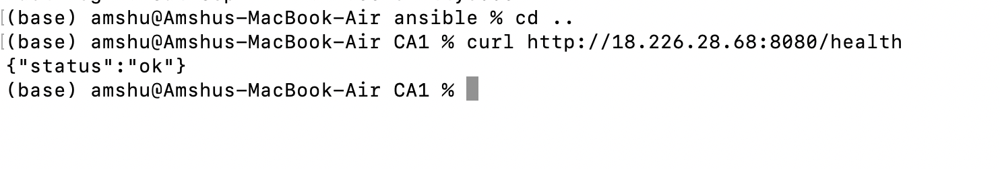
*The role's own `uri` health-check task confirming `/health` returns 200 before the play is considered done.*

## Validation / Smoke Test

After `ansible-playbook site.yml` finishes clean, this is the exact sequence used to prove the pipeline moves real data end to end. Every line is directly pasteable, with no manual IP lookup: `broker_private_ip` already lives in `inventory.ini`'s `[all:vars]`, so Ansible resolves it itself, and the one command that needs the database's public IP captures it from `terraform output` automatically.

```bash
# 1. Replay the dataset - broker_private_ip resolves from inventory.ini, nothing to edit
ansible producer -m command -a "docker run --rm -e KAFKA_BROKER={{ broker_private_ip }}:9092 producer"

# 2. Confirm the processor actually consumed and inserted it
# --become is required here: a fresh deploy's ad-hoc docker commands can hit
# "permission denied ... docker.sock" before the ubuntu user's docker-group
# membership is picked up by that session, even though the processor role's
# own build/run tasks already succeeded. --become uses sudo instead, sidestepping it.
ansible processor -m shell -a "docker logs --tail 30 processor" --become

# 3. Confirm the REST API is reachable and returning real data - grabs its own IP
DB_IP=$(cd ../terraform && terraform output -json public_ips | python3 -c "import json,sys; print(json.load(sys.stdin)['database'])")
curl http://$DB_IP:8080/health
curl http://$DB_IP:8080/alerts
```

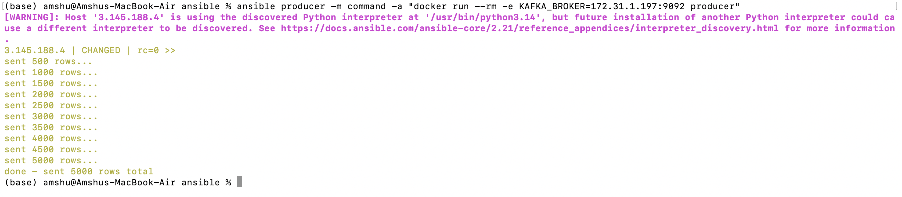
*`done - sent 5000 rows total`.*

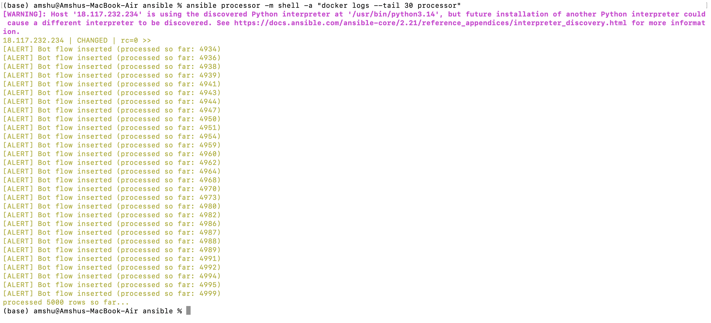
*Real `[ALERT] Bot flow inserted` lines, not a static log — the count climbs with each row.*

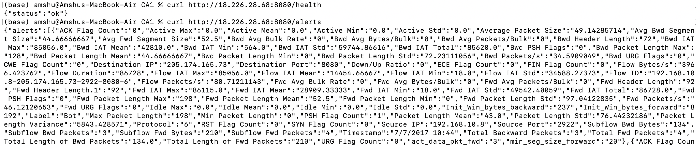
*`curl .../health` → `{"status":"ok"}`; `curl .../alerts` → real MongoDB-backed JSON labeled `"Bot"`.*

## Security

The security group (`ca1-pipeline-sg`) is created and fully managed by Terraform — there is no manually-configured firewall rule anywhere in this project. Exactly four inbound rules exist:

| Port | Protocol | Source | Purpose |
|---|---|---|---|
| 22 | TCP | your IP only | SSH |
| 8080 | TCP | your IP only | REST API |
| 9092 | TCP | self (security group) | Kafka, VM-to-VM only |
| 27017 | TCP | self (security group) | MongoDB, VM-to-VM only |

Egress is fully open (`0.0.0.0/0`), matching CA0.

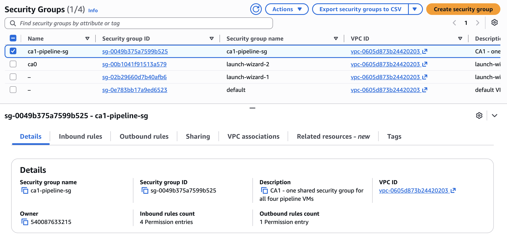
*The real security group's Details tab — 4 inbound, 1 outbound, matching the Terraform definition exactly.*

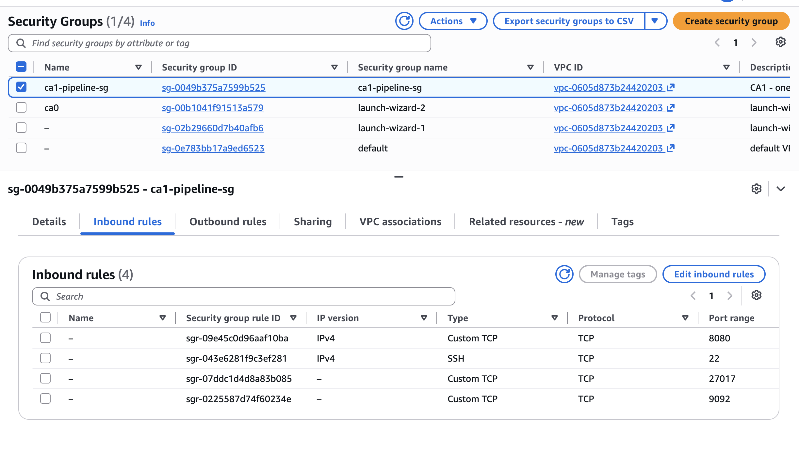
*The real, final `ca1-pipeline-sg` inbound rule table — not the instance-launch wizard.*

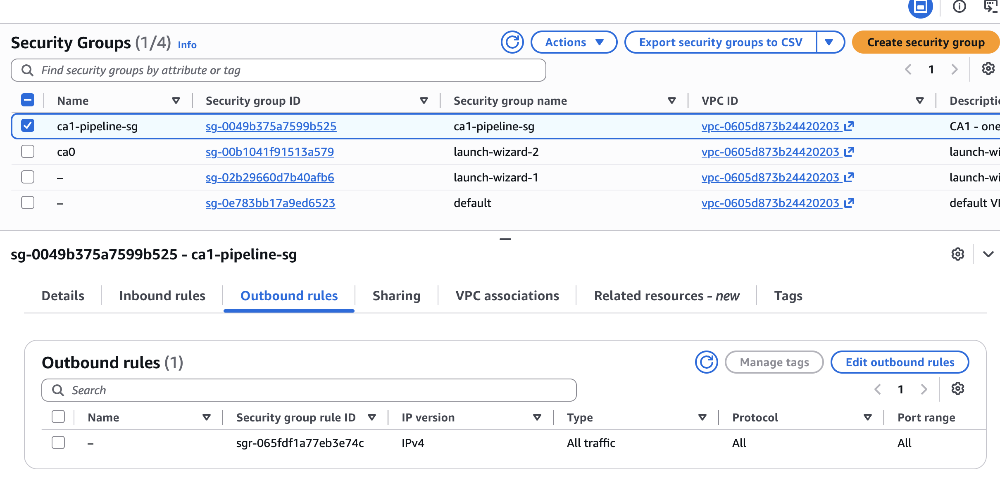
*The single all-traffic egress rule.*

Beyond the firewall:
- **SSH is key-only.** The key (`ca1-key`, RSA 4096) is generated by Terraform and saved locally with `0400` permissions; nothing is committed to the repo (`*.pem` is gitignored).
- **Both application containers run as a non-root user** (`appuser`), same as CA0.
- **MongoDB now requires authentication** — a change from CA0, where Mongo had none. Credentials come from Ansible Vault and are passed to Mongo, the processor, and the REST API as environment variables.
- **The REST API is a systemd service**, not a manually-started foreground process. It starts on boot (`WantedBy=multi-user.target`) and restarts automatically if it crashes (`Restart=on-failure`) — closing a gap from CA0, where the REST endpoint had to be started by hand after every reboot.

## Outputs Summary

Values below are from the most recent full deploy before final teardown; a fresh `terraform apply` will produce new IPs (`terraform output` shows current values at any time).

- **Kafka topic:** `network-flows`
- **MongoDB:** `db=ca0`, `collection=flows`, port `27017`, authentication enabled (credentials in `group_vars/all/vault.yml`)
- **REST endpoints (database VM, port 8080):**
  - `GET /health` → `{"status": "ok"}`
  - `GET /alerts` → up to 50 non-`BENIGN` flows as JSON
- **Example run's public IPs (from the demo video's recording session):** producer `18.219.203.198` · broker `18.226.251.51` · processor `18.118.2.204` · database `3.148.205.149`
- **Validation results:** all 4 hosts pinged successfully; all 6 Ansible roles completed with `failed=0, unreachable=0`; producer sent 5000/5000 rows; processor logged a climbing `[ALERT]` count reaching 5000; `/health` and `/alerts` both returned correct live data.

## Deviations From CA0

- **Subnet / AZ differs from CA0.** Terraform's `aws_subnets` data source picked `subnet-0c047edd51dfbe6f8` (AZ `us-east-2a`) rather than CA0's `subnet-0b00ba7301f12884e` (`us-east-2b`) — same default VPC, same connectivity, just a different subnet in the same pool since none was hardcoded.
- **`aws configure` instead of `aws login`.** Explained under Prerequisites — the Terraform AWS provider doesn't yet recognize `aws login`'s credential format.
- **MongoDB authentication added.** CA0 had none. `processor.py` and `rest_app.py` were both updated to accept `MONGO_USER`/`MONGO_PASSWORD` and authenticate when they're set, falling back to unauthenticated `MongoClient` only if they're absent (kept for local testing convenience).
- **REST API runs under systemd**, not as a manually-started foreground process — see Security, above. This directly addresses feedback on CA0 that services "starting on boot" needs to actually be demonstrated, not just claimed.
- **Every provisioning step is now literal, runnable code.** CA0's grading noted a few setup steps were summarized in prose rather than fully scripted; there's nothing left to summarize here — every install command lives in an Ansible task file.

## Testing / Verification

- [x] `terraform validate` passed after every file was added, incrementally — caught a real syntax error early
- [x] `terraform plan` / `apply` / `destroy` / `apply` round trip completed — proves reproducibility, not a one-time fluke
- [x] Final `terraform destroy` run against the fully-configured pipeline (not just bare infra), confirmed empty in the AWS console
- [x] `ansible all -m ping` — all four hosts reachable
- [x] All six Ansible roles completed with `failed=0, unreachable=0` in their PLAY RECAPs
- [x] Ansible Vault confirmed encrypted (AES256), not plaintext
- [x] Producer replay confirmed: 5000/5000 rows sent
- [x] Processor confirmed consuming and inserting: climbing `[ALERT]` count to 5000
- [x] REST API confirmed reachable externally: `/health` and `/alerts` both correct
- [x] Final Security Group inbound rules independently verified in the AWS console (not the launch wizard)

## Integrity Packet

See [`integritypacket.md`](./integritypacket.md) for the reasoning behind each major decision (Terraform+Ansible vs. alternatives, the `aws login` trade-off, the MongoDB-auth addition, and more), the AI-assisted work log, and the escalation path for states this automation can't safely resolve on its own.
